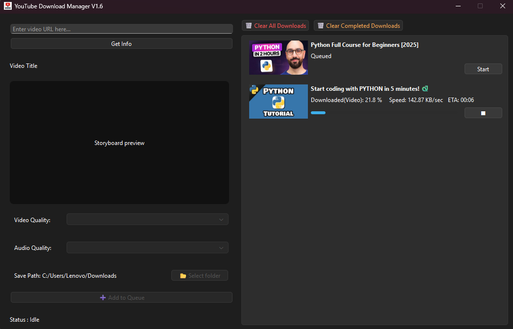
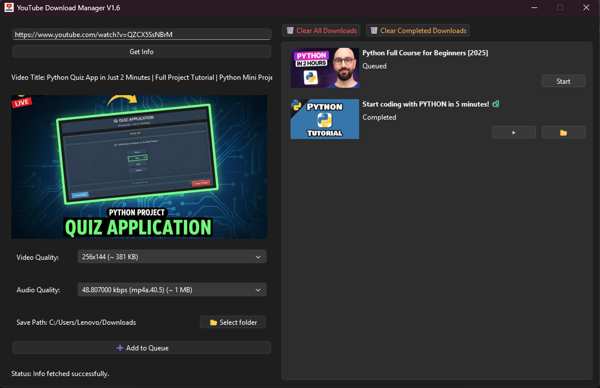

# 🎬 YouTube Download Manager

A lightweight, open-source **YouTube Download Manager** built with **C++ and Qt 6 (Qt Widgets)**.

This application allows you to download single videos or entire playlists, manage downloads in a queue, and resume interrupted downloads.

---

## 📸 Screenshots




---

## ✨ Features

- Download single videos and playlists
- Playlist navigation (Previous / Next)
- Jump to any playlist index
- Add current video playlist items to the queue
- Resume partially downloaded files
- Thumbnail preview for videos and playlists
- Play downloaded videos using the system default media player
- Open downloaded file location
- Queue-based download management
- Persistent download queue (saved on exit)

---

## 🛠 Built With

- **C++**
- **Qt 6 (Qt Widgets)**
- **yt-dlp**
- **FFmpeg**

---

## 🖥 Supported Platforms

- Windows 10 / 11 (x64)

> Linux support may be added in the future.

---

## 📦 Requirements

- Qt **6.10.1** or newer
- MSVC 2022 (for Windows builds)
- `yt-dlp.exe` (placed next to the application executable)
- `ffmpeg.exe` (placed next to the application executable)

---

## 🔧 Build Instructions (Windows)

1. Clone the repository:
   ```bash
   git clone https://github.com/yourusername/YouTubeDownloadManager.git
